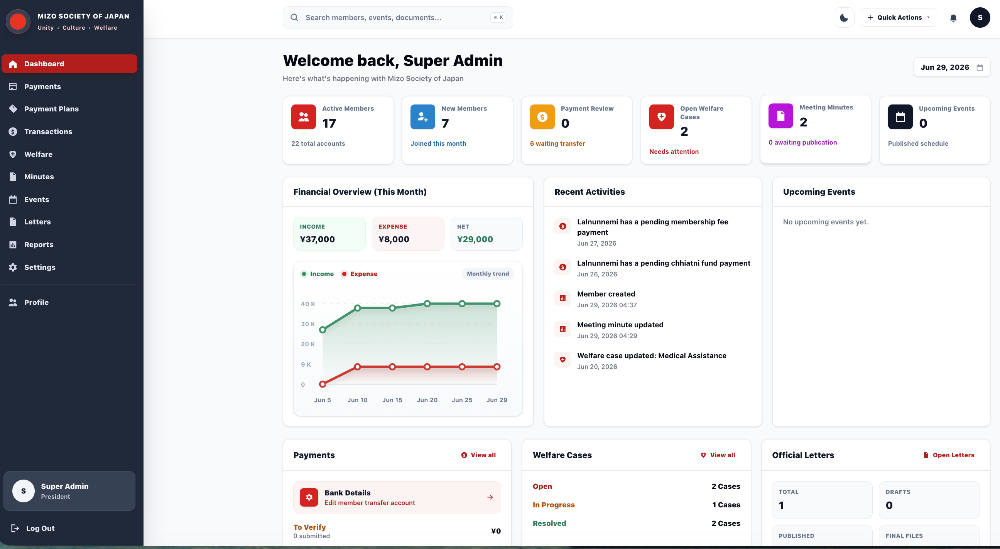

# Mizo Society of Japan Portal

A Ruby on Rails portal for the Mizo Society of Japan.

The portal helps MSJ manage members, payments, meeting minutes, welfare records, events, reports, and official letters in one place.



## Main Features

- Member registration and profile setup
- Role-based access for office bearers, executive members, and members
- Membership fees, donations, fundraisers, and bank transfer tracking
- Finance records and payment verification
- Meeting minutes with attendance, signatures, and PDF export
- Welfare case records for authorized officers
- Events and announcements
- Official letter composer
- Reports and dashboard summaries
- Responsive desktop and mobile layout
- Dark mode

## Tech Stack

- Ruby on Rails 8
- PostgreSQL
- Hotwire
- Tailwind CSS
- Devise
- Pundit

## Getting Started

Clone the repository:

```bash
git clone git@github.com:thadomaloma/mizo_society_japan.git
cd mizo_society_japan
```

Install dependencies:

```bash
bundle install
```

Prepare the database:

```bash
bin/rails db:prepare
```

Start the app:

```bash
bin/dev
```

Open:

```text
http://localhost:3000
```

## Seed Account

The seed file creates one super admin account only.

```text
Email: president@msj.local
Password: password123
```

For production, set your own seed values with environment variables before running `bin/rails db:seed`.

## Environment

Keep secrets in `.env` or production environment variables.

Do not commit `.env` to GitHub.

## Deployment

The app is designed for Rails deployment with PostgreSQL, such as Railway or a similar hosting service.

## License

This project is built for the Mizo Society of Japan.
